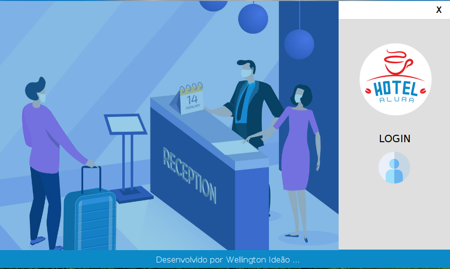
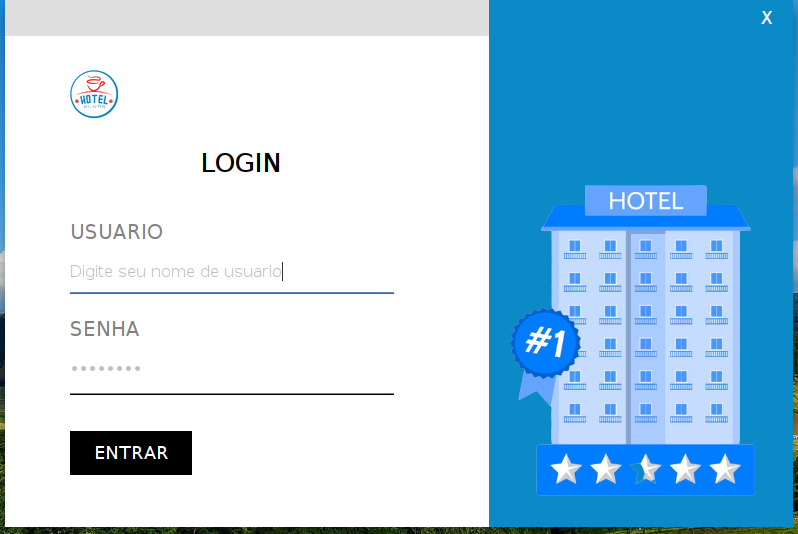
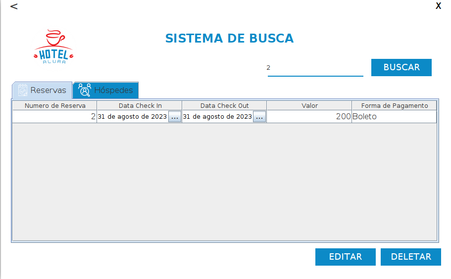
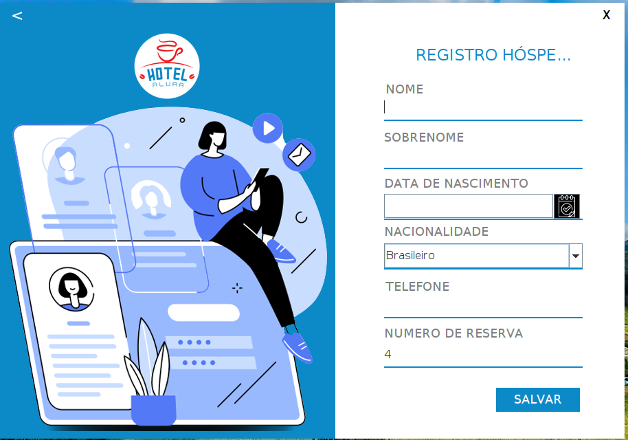

# Challenge ONE | Java | Back-end | Hotel Alura

     

<h3 align="center">
    🏨 Sistema de controle de reservas e hóspedes do Hotel Alura 🛎️
</h3>

 
 
  

<h4 align="center">
	🚧 Concluído 🚀 🚧
</h4>

Tabela de conteúdos
=====================

* [Sobre o projeto](#-sobre-o-projeto)
* [Funcionalidades](#-funcionalidades)
* [Layout](#-layout)
	* [Desktop](#desktop) 
* [Como executar o projeto](#-como-executar-o-projeto)
	* [Pré-requisitos](#pré-requisitos)
* [Tecnologias](#-tecnologias)
* [Autor](#-autor)
* [Licença](#-licença)

---

## 💻 Sobre o projeto

É um sistema para controle de reservas e hóspedes do Hotel Alura desenvolvido usando Java Swing e JDBC. Hotel Alura é conhecido por suas espetaculares instalações e pacotes promocionais para Desenvolvedores de Software.

Projeto desenvolvido para o Challenge Backend da Alura Oracle Next Education - ONE.

ONE é um programa de educação e empregabilidade com objetivo social de capacitar pessoas em tecnologia e conectá-las com o mercado de trabalho por meio de empresas parceiras.

---

## ⚙ Funcionalidades

- [x] Sistema de autenticação de usuários;
- [x] Permite criar, editar e excluir uma reserva para hóspedes;
- [x] Pesquisa informações sobre os hóspedes e suas reservas;
- [x] Registrar, editar e excluir os dados dos hóspedes;
- [x] Calcule o valor da reserva com base no número de dias da reserva e uma taxa diária;

---

## 🎨 Layout

### Desktop

  
  

  
  

---

## 🚀 Como executar o projeto

### Pré-requisitos
As seguintes ferramentas devem ser instaladas:
 * [Git](https://git-scm.com)
 * [Java 17](https://www.oracle.com/java/technologies/javase/jdk17-archive-downloads.html)
 * [Maven](https://maven.apache.org/download.cgi)
 * [Banco de dados MySQL](https://www.mysql.com/downloads)

### Como fazer o download: 

#### 🔹 Fork
1 - Faça o <strong>fork</strong> do projeto. No lado superior direito, ao clicar no ícone ele criará um repositório do projeto em sua conta pessoal do GitHub.  

     

 

2 - Após ter o repositório "forkado" para sua conta, verifica se a url da página é a do repositório da sua conta.

     

 

3 - Clique na opção <strong>Code</strong>. Ele apresentará três formas para instalar o repositório em sua máquina, e destacamos duas:

     

 

#### 🔹 Clonar ou baixar o ZIP

1 - Para clonar, basta copiar a <em>url</em> destacada na imagem e localizada logo abaixo do HTTPS, criar uma pasta em seu computador, abrir o <em>cmd</em> ou o <em>git bash</em> dentro dessa pasta e em seguida insira o comando <strong>git clone</strong> e com o botão direito do mouse dentro do terminal clicar na opção <strong>Paste</strong> para colar a <em>url</em> e dar <em>Enter</em>. 

     

 

2 - A segunda opção é baixar o código em um pacote <strong>"zipado"</strong> e extrair a pasta para o seu computador. 
  

---

## 🛠 Tecnologias
As seguintes ferramentas e tecnologias foram usadas na construção do projeto:
* [Git](https://git-scm.com)
* [Java 17](https://www.oracle.com/java/technologies/javase/jdk17-archive-downloads.html)
* [Eclipse IDE](https://www.eclipse.org/downloads)
* [Maven](https://maven.apache.org/download.cgi)
* [Banco de dados MySQL](https://www.mysql.com/downloads)
* [Biblioteca JCalendar](https://toedter.com/jcalendar)
* [Plugin Eclipse WindowBuilder](https://projects.eclipse.org/projects/tools.windowbuilder)
* [Java Swing](https://docs.oracle.com/javase/tutorial/uiswing)
* [JDBC - Java Database Connectivity](https://docs.oracle.com/javase/8/docs/technotes/guides/jdbc)
* [Java Swing Date Picker](https://github.com/LGoodDatePicker/LGoodDatePicker)
* [c3p0 - Pool de conexões JDBC](https://www.mchange.com/projects/c3p0)
* [Apache Commons codec - usada na criação hash SHA256](https://commons.apache.org/proper/commons-codec)

---

## 🦸 Autor

<a><b>Wellington Ideão</b></a> <a href="https://github.com/WellingtonIdeao" title="Github">🚀</a>

Feito por Wellington Ideão 👋🏽 Entre em contato!

---

## 📝 Licença
Este projeto esta sobe a licença [GPL-3.0](./LICENSE).

---

